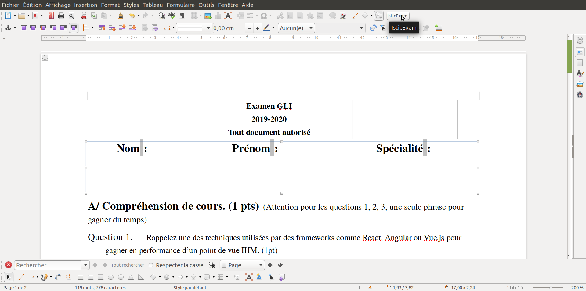

# Convert pdf 2 png (scan)

pdftoppm -png demo1.pdf out/document


# We provide a version of the editor 4 openoffice (only 4 mac and linux)
You have to install 

```bash
sudo apt-get install qrencode 
```


We provide a template for your examp in odt. 

